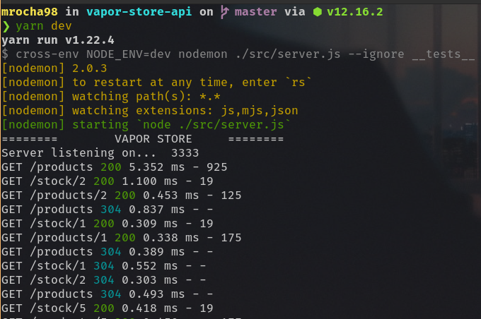

# Vapor Store - API

API utilizada pelo projeto [Vapor Store](https://github.com/mrocha98/vapor-store).

## License

Desenvolvido sob a licença [ISC](https://github.com/mrocha98/vapor-store-api/blob/master/license).
